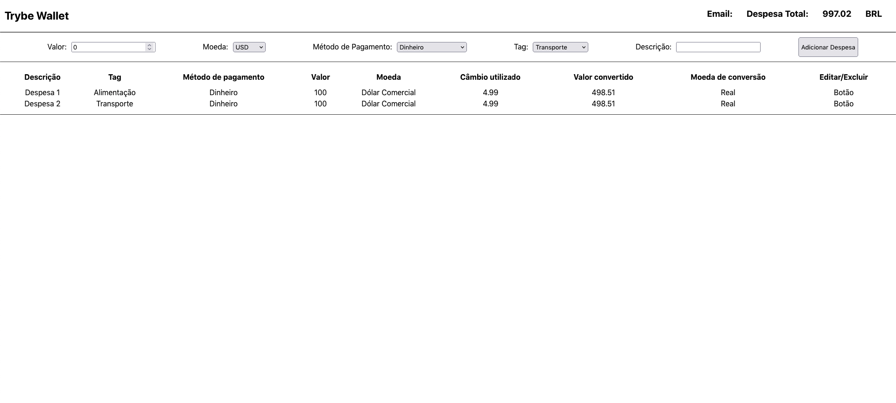

### Sobre o Projeto
No projeto Trybe Wallet o objetivo era criar uma carteira de controle de gastos, com conversor de moedas, usando React e Redux.

---

#### Habilidades colocadas em prática
  * Criar um store Redux em aplicações React

  * Criar reducers no Redux em aplicações React

  * Criar actions no Redux em aplicações React

  * Criar dispatchers no Redux em aplicações React

  * Conectar Redux aos componentes React

  * Criar actions assíncronas na sua aplicação React que faz uso de Redux.

### Preview

